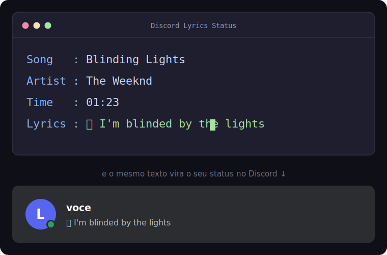

# 🎵 Discord Lyrics Status

Mostra no seu **status do Discord** a letra da música que está tocando no PC
(Spotify, YouTube, etc.), **sincronizada em tempo real**, linha por linha.
Quando você pausa a música, o status some sozinho.

Foi feito pra ser **fácil**: a maior parte é só dar **dois cliques** em arquivos `.bat`.

## 🎬 Como fica



> 💡 **Quer pôr um GIF/print seu de verdade?** Grave a tela (use `Win + Shift + S`
> para print, ou o Xbox Game Bar com `Win + G` para gravar), salve o arquivo como
> `demo.gif` (ou `demo.png`) **na pasta do projeto** e troque a linha de imagem
> acima por ``. Depois é só commitar.

---

## ⚠️ LEIA ISTO PRIMEIRO (importante)

- Isto é um **selfbot**: ele controla a **sua conta** usando o seu *token*.
  **Isso é contra as regras do Discord** e a sua conta **pode ser banida**.
  Use por sua conta e risco — de preferência numa **conta secundária**.
- O **token é igual à senha da sua conta** (quem tem ele entra sem senha e sem 2FA).
  - **Nunca** mande seu token pra ninguém, nem cole em sites/bots de "nitro grátis".
  - Aqui o token fica salvo **só no seu PC**, no arquivo `token.txt`.
  - Se ele vazar, **troque a senha do Discord** na hora (isso invalida o token antigo).

---

## ⚡ Resumo rápido (pra quem tem pressa)

1. Instale o **Python** (marcando *Add to PATH*).
2. Baixe este projeto (botão verde **Code → Download ZIP**) e extraia.
3. Dois cliques em **`instalar_dependencias.bat`**.
4. Pegue seu **token** (passo 4 abaixo) e dois cliques em **`configurar_token.bat`**.
5. Teste com **`testar.bat`** (toca uma música e veja a letra).
6. Dois cliques em **`instalar_autostart.bat`** pra ele iniciar sozinho com o Windows.

Pronto! Os detalhes de cada passo estão abaixo. 👇

---

## 💾 Jeito mais fácil: baixar o `.exe` (sem instalar Python)

Se você só quer **usar**, sem mexer com Python nem `.bat`:

1. Vá na aba **[Releases](../../releases)** e baixe o **`DiscordLyricsStatus.exe`**.
2. Coloque o `.exe` numa pasta sua (ex.: Documentos).
3. Dê **dois cliques**. Na **primeira vez** ele vai **pedir seu token** (veja como
   pegar no **Passo 4** abaixo) — cole e tecle Enter. Ele salva num `token.txt`
   ao lado do `.exe` (não precisa colocar de novo).
4. Toque uma música. 🎶

> 🧪 **Testar sem mexer no Discord:** abra o Prompt de Comando na pasta e rode
> `DiscordLyricsStatus.exe --preview`.
>
> 🚀 **Iniciar com o Windows:** aperte `Win + R`, digite `shell:startup`, e
> coloque um **atalho** do `.exe` (clique direito → *Enviar para → Área de
> trabalho*, depois mova o atalho pra essa pasta).

O restante do README (instalar Python, `.bat`, etc.) é para quem quer rodar pelo
**código-fonte** ou modificar o projeto.

---

## 📱 Quer no Android, Linux ou Mac?

Esta versão principal é **só Windows**. Para **celular (Android via Termux)** ou
outros sistemas, veja a **[versão Spotify](spotify/)**: é Python puro e detecta a
música pela **API do Spotify** — roda em qualquer lugar, mas **só** pega o que
toca no Spotify (não pega YouTube, navegador, etc.).

---

## 📋 O que você precisa (modo código-fonte)

- **Windows 10 ou 11** (só funciona no Windows)
- **Python 3.8 ou mais novo**
- Uma conta do **Discord**

---

## 🚀 Passo a passo completo

### Passo 1 — Instalar o Python

1. Acesse **https://www.python.org/downloads/** e baixe o instalador do Windows.
2. Abra o instalador e, **MUITO IMPORTANTE**, marque a caixinha
   **“Add python.exe to PATH”** lá embaixo, **antes** de clicar em *Install Now*.
3. Conclua a instalação.

> 💡 Evite a versão do Python da **Microsoft Store** — ela costuma dar problema.
> Use a do site oficial (python.org).

**Como saber se deu certo:** aperte `Win + R`, digite `cmd` e Enter. Na janela preta,
digite `python --version` e tecle Enter. Tem que aparecer algo como `Python 3.12.x`.

### Passo 2 — Baixar este projeto

1. No GitHub, clique no botão verde **`Code`** → **`Download ZIP`**.
2. Extraia o ZIP onde quiser (ex.: na pasta **Downloads**).
3. Abra a pasta extraída. É de lá que você vai usar os arquivos `.bat`.

### Passo 3 — Instalar as dependências

Dois cliques em **`instalar_dependencias.bat`**.
Vai abrir uma janela preta, baixar umas coisas e dizer **“instaladas com sucesso”**.
Pode fechar quando terminar.

### Passo 4 — Pegar o SEU token do Discord

> Faça isso pelo **navegador** (Chrome, Edge ou Firefox), no Discord aberto no site.

1. Entre em **https://discord.com/app** e faça login.
2. Aperte **`F12`** (abre as Ferramentas de Desenvolvedor).
3. Clique na aba **`Network`** (ou “Rede”).
4. No filtro, escolha **`Fetch/XHR`** (ou digite `api` no campo de filtro).
5. Clique em qualquer servidor/canal pra gerar movimento. Vão aparecer várias
   linhas com `discord.com/api/...`. Clique em **uma** delas.
6. Vá em **`Headers`** → role até **`Request Headers`** → ache a linha:
   ```
   authorization: SEU_TOKEN_APARECE_AQUI
   ```
7. Copie **só o valor** (sem a palavra `authorization:`).

> ❌ **Nunca** cole código no **Console** (F12 → Console) que alguém mandou. Isso é
> o golpe mais comum de roubo de token (o próprio Discord avisa em vermelho lá).
> O jeito da aba **Network** acima é o seguro.

### Passo 5 — Salvar o token

Dois cliques em **`configurar_token.bat`** → **cole** o token → tecle **Enter**.
Ele cria o arquivo `token.txt` (que fica só no seu PC). Pronto, não precisa
colocar de novo, mesmo depois de reiniciar.

### Passo 6 — Testar (recomendado)

Dois cliques em **`testar.bat`**. Toque uma música — a letra deve aparecer na
janela. Esse modo **não mexe no Discord** (é só pra você ver funcionando).
Feche a janela pra sair.

### Passo 7 — Usar de verdade

Você tem duas opções:

- **Iniciar sozinho com o Windows (recomendado):** dois cliques em
  **`instalar_autostart.bat`**. A partir daí ele liga junto com o PC, **escondido**
  (sem janela). Pra começar agora sem reiniciar, dê dois cliques no atalho que
  apareceu (`DiscordLyricsStatus.vbs` na pasta de Inicialização) — ou só reinicie.

- **Abrir só quando quiser:** rode `python lyrics.py` (ou use `testar.bat` tirando
  o `--preview`).

### Ajustar a frequência de atualização

Por segurança, o status é atualizado **no máximo 1 vez a cada X segundos** (padrão
**5**). Você escolhe o valor, dentro da faixa permitida de **2 a 3600 segundos**
(o programa não deixa ir mais rápido que 2s pra não tomar rate-limit/ban).

**Jeito fácil:** dois cliques em **`configurar_intervalo.bat`**, digite os segundos.
O valor fica **salvo** e vale também pro `.exe` e pro **início automático**.

**Pela linha de comando:**

```bash
python lyrics.py --interval 8    # usa 8s e salva pras proximas vezes
python lyrics.py --set-interval 10   # so salva 10s e sai (nao inicia)
```

> Quanto **maior** o número, **menos** requisições ao Discord (menor risco), mas a
> letra acompanha com um pouco mais de atraso. O valor salvo fica em `interval.txt`
> (ao lado do programa). Quer mudar a faixa permitida? Edite `MIN_INTERVAL`/
> `MAX_INTERVAL` no topo do `lyrics.py`.

---

## 🌍 Idiomas

A interface detecta **automaticamente o idioma do Windows**. Já vem traduzida em
**12 idiomas**: Inglês, Português, Espanhol, Francês, Alemão, Italiano, Russo,
Japonês, Coreano, Chinês (simplificado), Turco e Polonês.

Para trocar manualmente: dois cliques em **`configurar_idioma.bat`** (ou
`python lyrics.py --lang es`). Para voltar ao automático, rode o `.bat` e deixe vazio.

> 💡 A **letra das músicas** funciona em **qualquer idioma** (coreano, japonês, etc.).
> Isto aqui é só o idioma dos **textos do programa**.
>
> Quer ajudar a traduzir? Copie `_i18n/base.json` (parte `en`) para
> `_i18n/<codigo>.json`, traduza os valores e rode `python _build_lang.py`.

---

## 🛑 Como controlar

| Quero... | Faça |
|---|---|
| **Parar** o programa agora | dois cliques em **`parar.bat`** |
| **Desligar** o início automático | dois cliques em **`desinstalar_autostart.bat`** |
| **Trocar** o token | rode **`configurar_token.bat`** de novo |
| **Saber se está rodando** | veja seu status no Discord, ou procure `pythonw.exe` no Gerenciador de Tarefas |

---

## 📂 Pra que serve cada arquivo

| Arquivo | O que faz |
|---|---|
| `lyrics.py` | O programa em si |
| `requirements.txt` | Lista do que o Python precisa instalar |
| `instalar_dependencias.bat` | Instala o que o programa precisa |
| `configurar_token.bat` | Salva seu token no `token.txt` |
| `configurar_intervalo.bat` | Define de quantos em quantos segundos o status atualiza |
| `configurar_idioma.bat` | Escolhe o idioma da interface |
| `testar.bat` | Testa no terminal sem mexer no Discord (modo preview) |
| `instalar_autostart.bat` | Liga o início automático com o Windows (escondido) |
| `desinstalar_autostart.bat` | Desliga o início automático |
| `parar.bat` | Encerra o programa |
| `token.txt` | Onde seu token fica salvo (criado por você; **nunca** compartilhe) |

---

## ❓ Deu problema? (soluções comuns)

**“python não é reconhecido como comando”**
→ O Python não foi instalado com a opção *Add to PATH*. Reinstale pelo python.org
marcando **“Add python.exe to PATH”**.

**O status do Discord não muda**
→ Confira: (1) o token está certo? rode `configurar_token.bat` de novo;
(2) tem música **tocando** (não pausada)? (3) essa música tem letra sincronizada
disponível? (algumas músicas não têm).

**Apareceu “401” em algum lugar**
→ Token inválido ou expirado. Pegue o token de novo (passo 4) e salve de novo (passo 5).

**Abriu a Microsoft Store quando tentei rodar**
→ Você está usando o atalho de Python da Store. Instale o Python pelo python.org.

**Quero ver a letra mas o autostart roda escondido**
→ Use o `testar.bat` pra ver no terminal. O autostart é proposital sem janela.

---

## 🙋 Perguntas frequentes

**Isso rouba meus dados?**
Não. O token é enviado **só** para a API oficial do Discord (`discord.com`), pra
trocar o status. A letra vem de provedores públicos de letras. Mas, como é
selfbot, o risco real é **banimento da conta** — não roubo de dados.

**Funciona no celular / Mac / Linux?**
Não. Só no **Windows**, porque usa as APIs de mídia do Windows.

**Preciso deixar algo aberto?**
O programa precisa estar rodando (em segundo plano) pra atualizar o status.
Com o autostart, ele cuida disso sozinho enquanto o PC estiver ligado.

---

## 📄 Licença

Distribuído sob a licença **MIT** — veja o arquivo [LICENSE](LICENSE).
Pode usar, modificar e compartilhar à vontade.

---

*Feito por diversão. Use com responsabilidade e ciente do risco de ban.*
